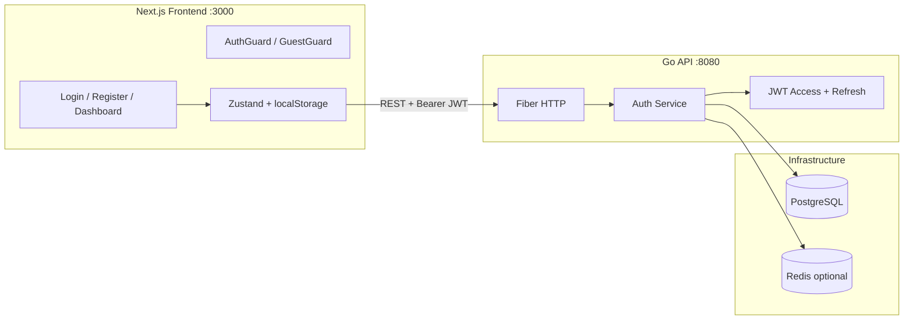
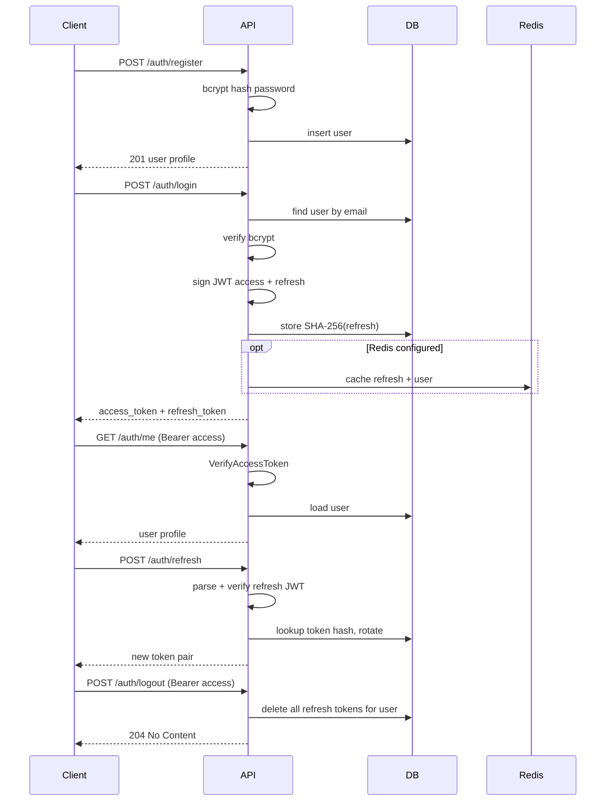

# Authentication Next.js + Go 101

A full-stack authentication application demonstrating JWT-based auth with a **Next.js** frontend and a **Go (Fiber)** backend API. Users can register, log in, refresh tokens, access a protected dashboard, and log out with server-side refresh token revocation.

## Tech Stack

| Layer | Technology |
| ----- | ---------- |
| **Frontend** | Next.js 16, React 19, TypeScript, Tailwind CSS 4, shadcn/ui, Zustand, Axios |
| **Backend** | Go 1.25, Fiber v2, GORM, PostgreSQL 16, Redis 7 (optional) |
| **Auth** | JWT access + refresh tokens (`golang-jwt/jwt/v5`), bcrypt password hashing |
| **Observability** | Prometheus metrics, OpenTelemetry tracing, structured JSON logs |

## Repository Structure

```
authentication-nextjs-go-101/
├── back-end/                 # Go API server
│   ├── cmd/
│   │   ├── server/           # HTTP API entry point
│   │   ├── migrate/          # Database migrations
│   │   └── worker/           # Standalone token-cleanup worker
│   ├── internal/
│   │   ├── handlers/         # HTTP handlers
│   │   ├── service/          # Auth business logic
│   │   ├── middleware/       # Auth, rate limiting, logging, metrics
│   │   ├── models/           # User, RefreshToken
│   │   ├── repository/       # Database access layer
│   │   ├── cache/            # Redis + PostgreSQL refresh token stores
│   │   └── config/           # Environment configuration
│   ├── migrations/           # SQL migrations (golang-migrate)
│   ├── postman/              # Postman collection for API testing
│   ├── scripts/dev.sh        # One-command local dev bootstrap
│   └── docker-compose.yml    # PostgreSQL, Redis, PgBouncer
├── front-end/                # Next.js App Router frontend
│   ├── app/                  # Routes: /, /login, /register, /dashboard
│   ├── components/           # UI, auth forms, route guards
│   ├── hooks/                # Auth hooks, token countdown
│   ├── lib/                  # API client, token refresh, storage
│   └── stores/               # Zustand auth state
└── README.md                 # This file
```

## Architecture



### Authentication Flow



**Frontend token management:** Access and refresh tokens are stored in `localStorage`. The client proactively refreshes tokens 60 seconds before expiry and reactively retries on `401 AUTH_INVALID` responses. Route protection is handled client-side via `AuthGuard` and `GuestGuard` components (no Next.js middleware).

## Prerequisites

- **Go** 1.22+
- **Node.js** 20+
- **Docker** (for PostgreSQL and Redis)

## Quick Start

### 1. Start the Backend

```bash
cd back-end
cp .env.example .env
# Edit .env — JWT secrets must be at least 32 characters
./scripts/dev.sh
```

`scripts/dev.sh` starts Docker services (PostgreSQL + Redis), runs migrations, and starts the API at **http://localhost:8080**.

**Manual alternative:**

```bash
cd back-end
docker compose up -d
cp .env.example .env
go mod tidy
go run ./cmd/migrate
go run ./cmd/server
```

### 2. Start the Frontend

```bash
cd front-end
npm install
cp .env.local.example .env.local
npm run dev
```

Open **http://localhost:3000**.

## API Reference

| Method | Path | Auth | Rate Limited | Description |
| ------ | ---- | ---- | ------------ | ----------- |
| `GET` | `/health` | No | No | Health check (DB + Redis) |
| `GET` | `/ready` | No | No | Readiness probe |
| `GET` | `/metrics` | No | No | Prometheus metrics |
| `POST` | `/auth/register` | No | Yes (10/min/IP) | Register a new user |
| `POST` | `/auth/login` | No | Yes | Login and receive token pair |
| `POST` | `/auth/refresh` | No | Yes | Rotate access + refresh tokens |
| `POST` | `/auth/logout` | Bearer access | No | Revoke all refresh tokens |
| `GET` | `/auth/me` | Bearer access | No | Get current user profile |

### Request / Response Examples

**Register** — `POST /auth/register`

```json
{ "email": "user@example.com", "password": "password123" }
```

Response `201`:

```json
{ "id": "uuid", "email": "user@example.com", "created_at": "2026-01-01T00:00:00Z" }
```

**Login** — `POST /auth/login`

```json
{ "email": "user@example.com", "password": "password123" }
```

Response `200`:

```json
{ "access_token": "...", "refresh_token": "...", "expires_in": 900 }
```

**Protected routes** — include header:

```
Authorization: Bearer <access_token>
```

## Frontend Routes

| Route | Guard | Description |
| ----- | ----- | ----------- |
| `/` | None | Redirects to `/dashboard` or `/login` |
| `/login` | `GuestGuard` | Sign in form |
| `/register` | `GuestGuard` | Create account (redirects to login on success) |
| `/dashboard` | `AuthGuard` | Protected profile view with token expiry countdown |

## Environment Variables

### Backend (`back-end/.env`)

| Variable | Required | Default | Description |
| -------- | -------- | ------- | ----------- |
| `DATABASE_URL` | Yes | — | PostgreSQL connection string |
| `JWT_ACCESS_SECRET` | Yes | — | Access JWT signing key (≥ 32 chars) |
| `JWT_REFRESH_SECRET` | Yes | — | Refresh JWT signing key (≥ 32 chars) |
| `PORT` | No | `8080` | HTTP listen port |
| `APP_ENV` | No | `development` | Set to `production` for JSON logs |
| `DATABASE_READ_URL` | No | `DATABASE_URL` | Read replica for user lookups |
| `REDIS_URL` | No | `""` | Redis URL; enables cache, distributed rate limiting |
| `DB_MAX_OPEN_CONNS` | No | `25` | DB pool max open connections |
| `DB_MAX_IDLE_CONNS` | No | `10` | DB pool max idle connections |
| `DB_CONN_MAX_LIFETIME` | No | `30m` | DB connection max lifetime |
| `BCRYPT_MAX_CONCURRENT` | No | `4` | Max concurrent bcrypt operations |
| `JWT_ACCESS_EXPIRY` | No | `15m` | Access token TTL |
| `JWT_REFRESH_EXPIRY` | No | `168h` | Refresh token TTL (7 days) |
| `CORS_ORIGIN` | No | `http://localhost:3000` | Allowed frontend origin |
| `OTEL_EXPORTER_OTLP_ENDPOINT` | No | `""` | OpenTelemetry OTLP endpoint |

### Frontend (`front-end/.env.local`)

| Variable | Required | Default | Description |
| -------- | -------- | ------- | ----------- |
| `NEXT_PUBLIC_API_URL` | No | `http://localhost:8080` | Backend API base URL |

Ensure backend `CORS_ORIGIN` matches the frontend origin (`http://localhost:3000`).

## Security

- **Password hashing** — bcrypt with cost factor 12; passwords are never stored in plain text
- **Refresh token storage** — only SHA-256 hashes are persisted; a DB leak cannot replay tokens
- **Token rotation** — each `/auth/refresh` call invalidates the old refresh token and issues a new pair
- **Rate limiting** — auth endpoints limited to 10 requests/minute per IP (Redis-backed when available)
- **Logout** — revokes all refresh tokens for the user server-side

## Testing

### Postman

Import from `back-end/postman/`:

1. `Auth-API.postman_collection.json` — all API requests with auto-tests
2. `Local.postman_environment.json` — local variables

**Suggested order:** Health Check → Register → Login → Get Me → Refresh Token → Logout

### curl

```bash
# Health check
curl http://localhost:8080/health

# Register
curl -X POST http://localhost:8080/auth/register \
  -H "Content-Type: application/json" \
  -d '{"email":"test@example.com","password":"password123"}'

# Login
curl -X POST http://localhost:8080/auth/login \
  -H "Content-Type: application/json" \
  -d '{"email":"test@example.com","password":"password123"}'

# Get profile (replace ACCESS_TOKEN)
curl http://localhost:8080/auth/me \
  -H "Authorization: Bearer ACCESS_TOKEN"
```

## Further Reading

- [back-end/README.md](back-end/README.md) — backend setup, API details, and project structure
- [front-end/README.md](front-end/README.md) — frontend features, routes, and scripts
